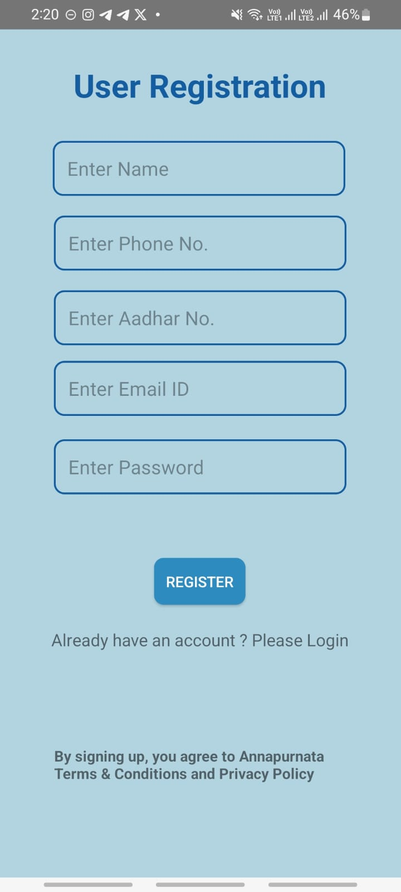
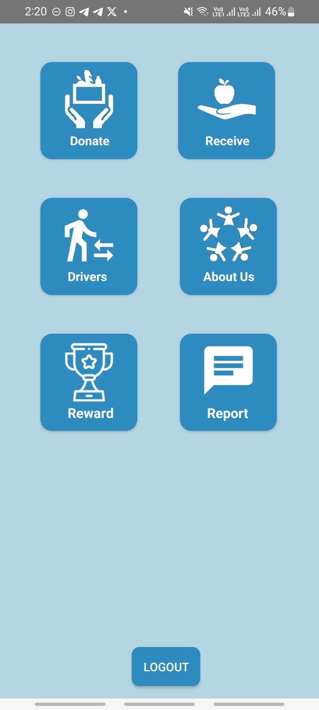
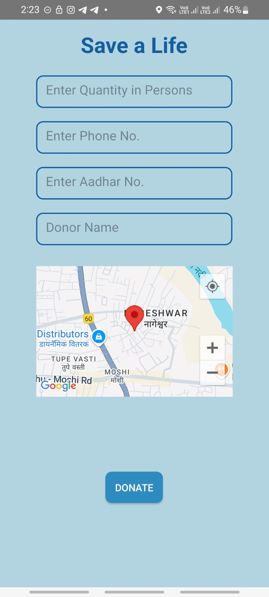
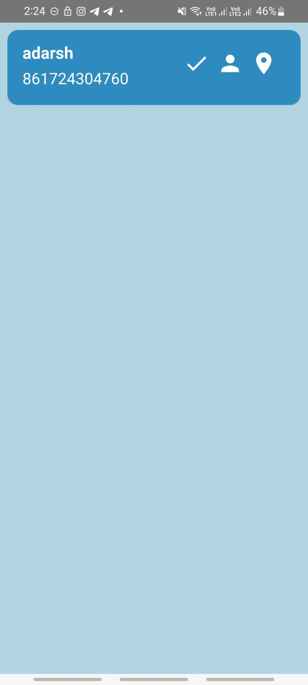
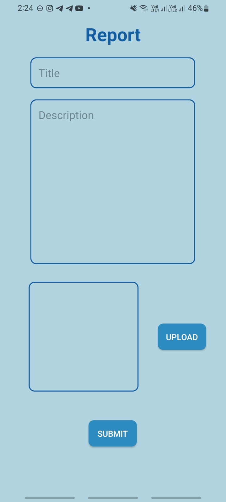
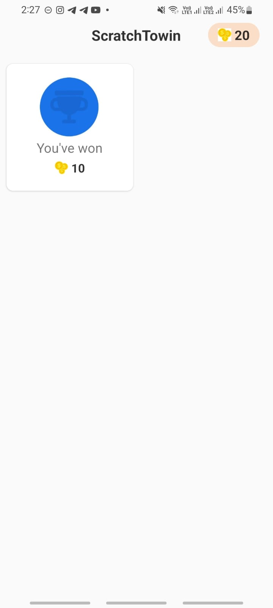

# 🍱 Annapurnata – Food Donation

Annapurnata is an Android-based food donation app designed to connect donors and receivers seamlessly, ensuring safe and timely food distribution. The app aims to reduce food waste while encouraging responsible donation through reward mechanisms and strict user verification.

## ✨ Key Features

- 🔐 **User Authentication**: Donors and Receivers can securely log in/register with Aadhar-based verification to prevent misuse.
- 📍 **Location Sharing**: Donor location is recorded and visible to the Driver Panel for food pickup.
- 📞 **Contact & Donation Info**: Donors provide contact number and food details for receiver acknowledgment.
- 🎁 **Reward System**: Donors receive rewards after successful donation.
- 🚨 **Food Quality Report**: Receivers can report poor-quality food. Strict measures prevent misuse.
- 🚗 **Driver Panel**: Drivers view real-time donor locations and collect food for delivery.
- ✅ **Acknowledgment**: Receivers confirm food collection via the app.

---

## 📸 Screenshots

  <b>🔐 Registration</b> &nbsp;&nbsp;&nbsp;&nbsp;
  <b>🏠 Home Page</b> &nbsp;&nbsp;&nbsp;&nbsp;
  <b>🍲 Donate Food</b>

  
  
  

  <b>📋 Donor List</b> &nbsp;&nbsp;&nbsp;&nbsp;
  <b>ℹ️ Donor Info</b> &nbsp;&nbsp;&nbsp;&nbsp;
  <b>🚨 Food Report</b>

  
  
  

  <b>🎁 Reward Screen</b>

  

---

## 🛠 Tech Stack

- **Language**: Java  
- **UI**: XML  
- **Database**: Firebase Realtime Database  
- **Map & Location**: Google Maps API (for pickup coordination)

---

## 🧱 Architecture

This app follows the **MVC architecture**:
- **Model**: Data classes for user, food, and reports.
- **View**: XML layouts for login, donation, acknowledgment, and reporting.
- **Controller**: Java logic for handling data, intents, and Firebase communication.

---

## 📄 How to Use

1. **Login/Register** as Donor or Receiver (Aadhar mandatory).
2. Donor **adds food details**, location, and contact info.
3. **Driver panel** sees nearby donors and picks up food.
4. **Receiver confirms** food received.
5. Donor receives **reward**, and receiver can **report issues** if needed.

---

## 🤝 Contribution

Feel free to fork this repo, improve features, or optimize UI. Pull requests are welcome!

---

## 📬 Contact

For queries or suggestions, reach out via GitHub or drop a message in the issues tab.

